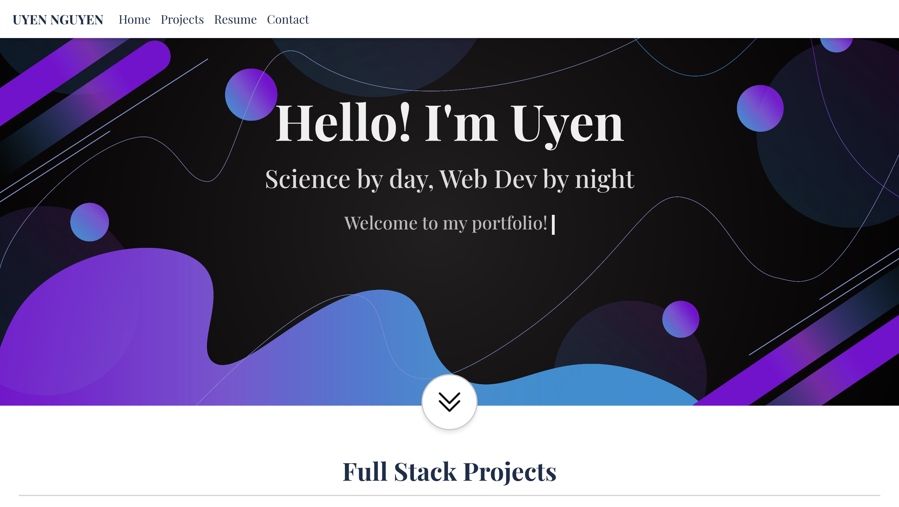
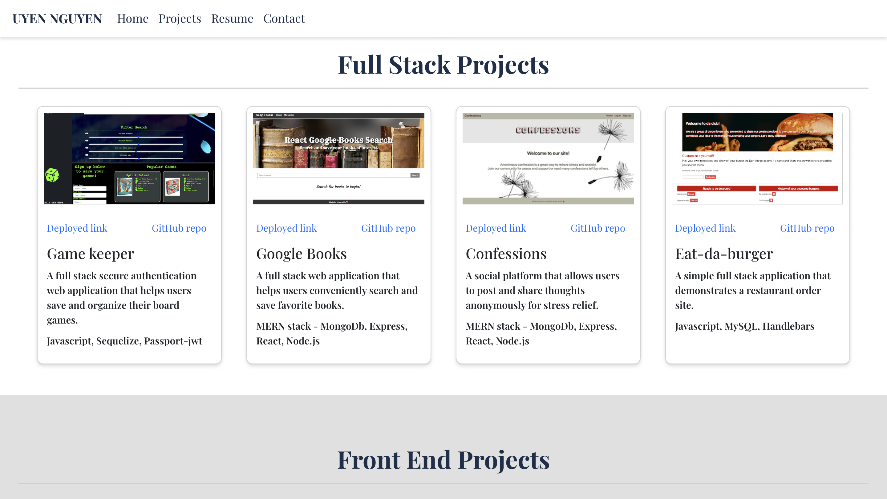
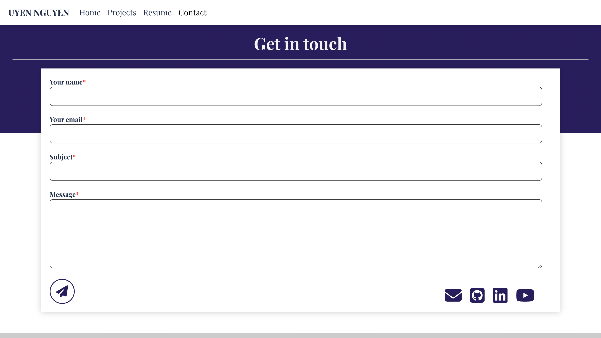

# React Personal Portfolio 

### Welcome to my personal portfolio built with React

Check it out [here](https://uyennguyen30696.github.io/react-portfolio/).

## Screenshots

## Technologies

* [ReactJS](https://reactjs.org/)
* [EmailJS](https://www.emailjs.com/) - Send message from contact from to chosen email address instead of storing in cloud database.
* [react-scroll-trigger](https://www.npmjs.com/package/react-scroll-trigger) - Control 
animation of targeted component in the viewport.

## Run the app on local

* Run `npm start` in terminal
* Before updating to Github pages, run `npm run build`, then run `npm run deploy` to deploy
* Note: To deploy the app on AWS S3, the "homepage" in the `package.json` needs to be empty, then run `npm run build` again before uploading the content in the `build` folder to the S3 bucket. The specified "homepage" is only for deploying on GitHub Pages.

Thank you for visiting! Feel free to contact me at nguyenuyen30696@gmail.com with any question.
