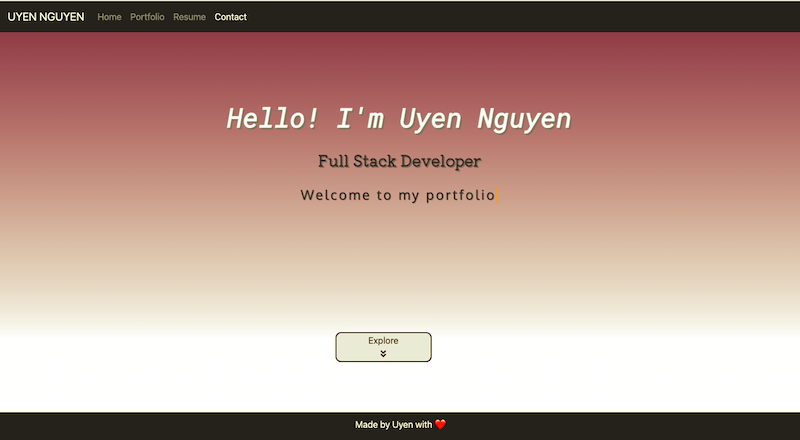
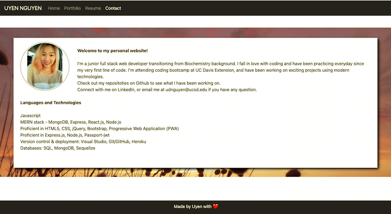
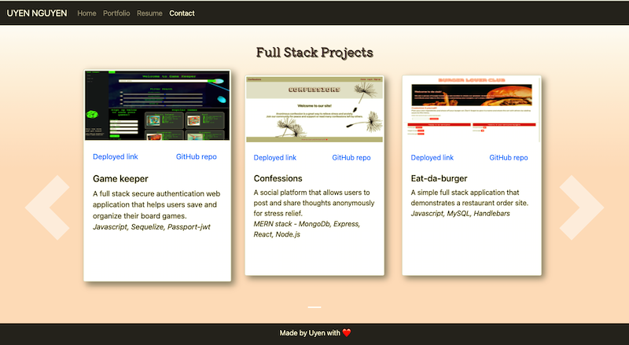

# React Personal Portfolio 

### Welcome to my personal portfolio built with React

Check it out [here](https://uyennguyen30696.github.io/react-portfolio/).

## Screenshots

## Content

* Home page - A brief statement about my professional background and the technologies I use

* Portfolio page - A showcase of my recent projects (full stack and front end)

* Resume - A link to my resume

* Contact page - My contact information, including LinkedIn and GitHub

## Technologies

* [ReactJS](https://reactjs.org/)
* [EmailJS](https://www.emailjs.com/) - Send message from contact from to chosen email address instead of storing in cloud database

Thank you for visiting! Feel free to contact me at udnguyen@ucsd.edu with any question.
